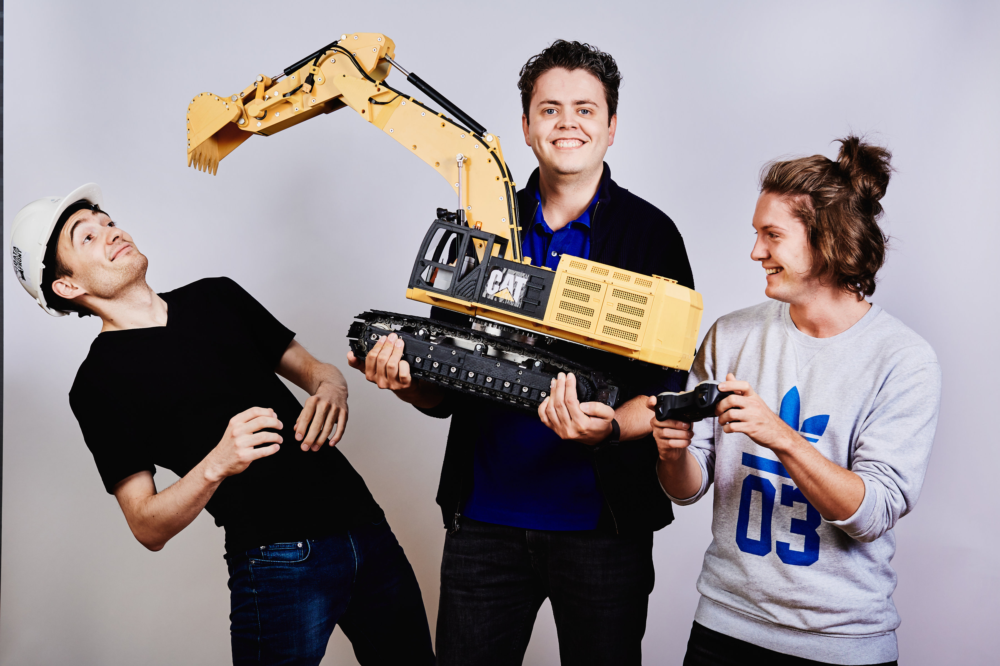
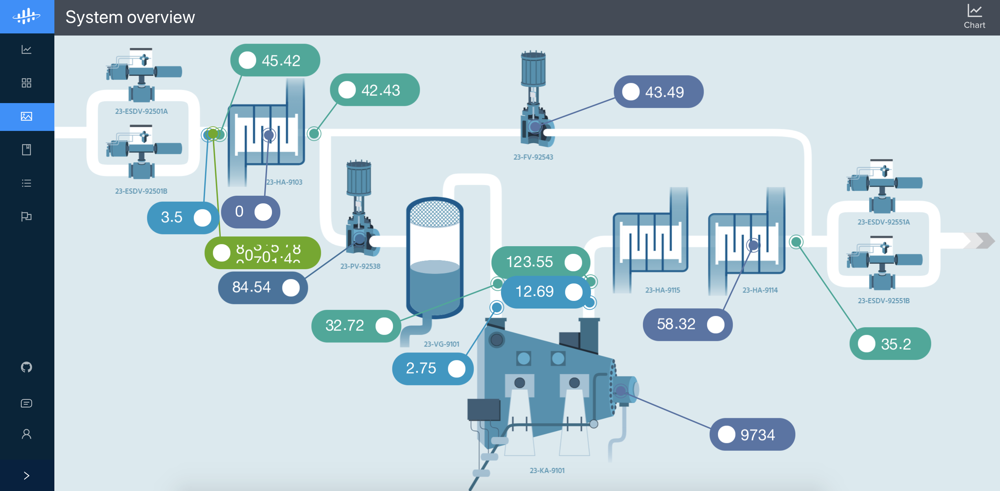

# University Hackathon on Open Industrial Data

Took a course on python programming in first year? Machine learning guru? Evangelical pythonista? Information designer? IoT geek? Welcome, we've got a spot for you all. We need your help to analyze and visualize the industrial world!

Speak up, ask questions and work together. We can't wait to see what you come up with!

# Instructions
Although this is a data science hackathon, we have designed it to cover multiple levels of experience. We start together, but then break out into different specializations, a lot like we do in our teams today at Cognite!

## Part 1: Get set up
- Head over to [openindustrialdata.com](openindustrialdata.com) and log in with a google account.
- Read up on the project in this [white paper](https://cognite.com/media/1145/open-industrial-data-cognite-akerbp.pdf). We need your help to analyze the data!
- Once logged in, head to the [Getting Started](https://openindustrialdata.com/get-started/) to generate an API key. Treat this key as a password, store it somewhere secure!
- Log in to [Cognite Operational Intelligence](https://opint.cogniteapp.com/publicdata/)!

<iframe src="https://player.vimeo.com/video/299176372" width="640" height="350" frameborder="0" allowfullscreen></iframe>

## Part 2: Explore the 1st Stage Gas Export Compressor train on the Valhall platform

We do infographics slightly differently here at Cognite: with real time data!
- Look through the infographics to find your way to the [System Overview](https://opint.cogniteapp.com/publicdata/infographics/-LOHKEJPLvt0eRIZu8mE)
- Pick a subsystem that you would like to analyze further (labelled on the diagram, e.g. '23-VG-9101') and write down the tag name.

## Part 3: Asset data dive
Let's get stuck into the data for our chosen asset. The Cognite [Python SDK](https://cognite-sdk-python.readthedocs-hosted.com/en/latest/ ) gives us full access to the industrial data.
The notebook [Part 3 - Asset data dive](Part 3 - Asset data dive.ipynb) walks us through the basics of how industrial data is represented in CDP.

If you have a notebook environment set up on your laptop, simply clone down this repo and get to work.
Otherwise, we recommend [Google Colab](https://colab.research.google.com/notebooks/welcome.ipynb#recent=true).

## Part 4: Specialization hackathon
Time to split into specializations! Build an engaging visualization in Operational Intelligence, or continue writing code!

### Part 4a: Real time data visualization
In your notebook from part 3, you generated a list of timeseries associated with your asset of choice. Let's liberate that data by creating an engaging visualization!
- Research your asset of choice
- Draw a simplified representation or find a diagram
- Attach time series in the relevant locations
- Publish your dashboard to the world!

### Part 4b: Data science
A bit excited about that time series data you saw in Part 3? We get it. Here are a couple ideas to get you started:
- Data quality investigation
- Graph analytics
- Supervised sensor prediction
- Unsupervised anomaly detection

And of course, we have [a notebook](Part 4b - Data Science.ipynb) to get you started.

## When you're done
Thanks for participating! Share your work with the world and contribute to the vision of Ope Industrial Data!

And don't forget that, like most other companies, we look at Github profiles when we recruit for the Data Science, and strongly encourage you to build up a history of **unique** work. It could be your foot in the door to your dream job :)