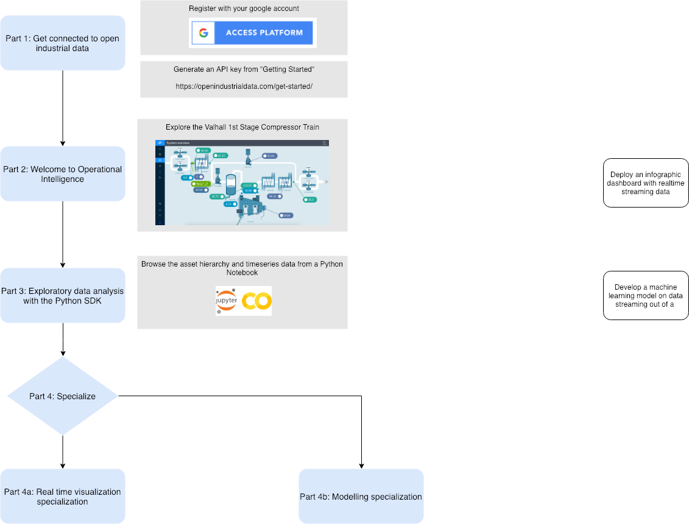

# University Hackathon on Open Industrial Data

Took a course on python programming in first year? Machine learning guru who thinks in python? Passionate about beautiful design? Welcome, we've got a spot for you all. We need your help to analyze and visualize the industrial world!

Speak up, ask questions and work together. We can't wait to see what you come up with!

# Instructions
Although this is a data science hackathon, we have designed it to cover multiple levels of experience. We start together, then break out into two workstreams.

